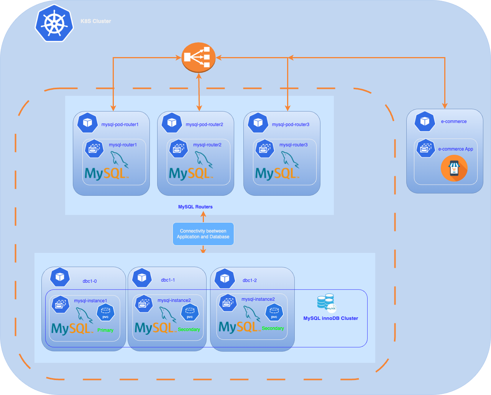

## Deployment of MySQL InnoDB Cluster in Kubernetes





As cloud-native applications continue to dominate the tech landscape, deploying databases within Kubernetes has become increasingly prevalent. MySQL, particularly with its InnoDB storage engine, stands out as a reliable choice for managing data in Kubernetes environments. The benefits of using MySQL in Kubernetes are numerous:

- **Scalability:** MySQL in Kubernetes allows you to easily scale your database instances up or down to meet changing application demands, ensuring optimal resource utilization.
- **High Availability:** With features like replication and clustering, MySQL can achieve high availability, minimizing downtime and ensuring that applications remain responsive even in the face of failures.
- **Automated Management:** Kubernetes simplifies the management of MySQL deployments with features such as automated failover, self-healing, and seamless upgrades, which greatly reduce operational overhead.
- **Consistent Development Environments:** By deploying MySQL on Kubernetes, development and production environments can remain consistent, easing the process of debugging and testing applications.
- **Microservices Compatibility:** MySQL fits well within microservices architectures, enabling applications to have their own dedicated databases while still facilitating efficient inter-service communication.

In this article, we will walk through the steps required to deploy a MySQL InnoDB cluster in Kubernetes using the Kubernetes manifest method, leveraging the advantages of MySQL to create a robust, scalable database solution that meets the demands of modern applications. Future articles will explore additional deployment methods, including the MySQL operator and tools like ArgoCD.

✅ **Step1:** Create a namespace

```bash
:> kubectl create namespace mysqldb
namespace/mysqldb created
:>
```

✅ **Step2:** Create the MySQL secret:

```yaml
apiVersion: v1
kind: Secret
metadata:
  name: mysql-secret
type: Opaque
data:
  password: LW4gQmVuY2gxMjMK 
  admin-password: LW4gQmVuY2gxMjMK 
```

```bash
:> kubectl apply -n mysql1 -f secret.yaml
secret/mysql-secret created
:>
```

The password is deployed with each Pod, and is used by management scripts and commands for MySQL InnoDB Cluster and ClusterSet deployment in this tutorial.

✅ **Step3:** Create a named secret containing Oracle Cloud Infrastructure credentials

When you install the application using Kubernetes manifes or Helm, use a Kubernetes secret to provide the authentication details to pull an image from the remote repository.

The Kubernetes Secret contains all the login details you provide if you were manually logging in to the remote Docker registry using the docker login command, including your credentials.

Create a secret by providing the credentials on the command-line by using the following command :

ora-cont-secret.yaml:

```yaml
apiVersion: v1
kind: Secret
metadata:
  name: oracle-registry-secret
type: kubernetes.io/dockerconfigjson
data: 
 .dockerconfigjson:XXXXXXXXXXXXX
```

**dockerconfigjson** corresponds to these JSON entries encoded in base64 :

```json
{
    "auths":{
          "container-registry.oracle.com": {   
        "username":"USERNAME",
        "password":"XXXXXXXX",
        "email":"EMAIL"
         }
        }
}

```

- *container-registry.oracle.com:* Name of Oracle container registry.
- *USERNAME:* User name to access the remote Oracle container registry. The format varies based on your Kubernetes platform.
- *PASSWORD:* Password to access the remote Oracle container registry.
- *EMAIL:* Email ID for your Docker registry.

We will encode the JSON string with the following command:

```bash
:> echo -n '{"auths":{"container-registry.oracle.com":{"username":"xxxx","password":"xxxx","email":"xxx@xxx"}}}' | base64

```

You should get something like:

```bash
eyJhdXRocyI6eyJjb250YWluZXItcmVnaXN0cnkub3JhY2xlLmNvbSI
```

Use the encoded output in your Secret: Then, insert this encoded code into your secret definition. The YAML file should look like this:

```yaml
apiVersion: v1
kind: Secret
metadata:
  name: oracle-registry-secret
type: kubernetes.io/dockerconfigjson
data: 
 .dockerconfigjson: eyJhdXRocyI6eyJjb250YWluZXItcmVnaXN0cnkub3JhY2xlLmNvbSI6eyJ1c2VybmFtZSI6Im1jb2
```

Apply the Secret to Kubernetes:

```bash
:> kubectl -n mysqldb apply -f ora-cont-secret.yaml
secret/oracle-registry-secret created
:>
```

You can also create a secret based on existing credentials. See [Create a Secret based on existing credentials](https://kubernetes.io/docs/tasks/configure-pod-container/pull-image-private-registry/#registry-secret-existing-credentials.)

✅ **Step4:** Deployment of 3 MySQL instances

We will now deploy our 3 MySQL instances using a Kubernetes StatefulSet deployment.  
Why a StatefulSet? Because a StatefulSet is well-suited for a MySQL cluster due to its ability to manage state, ensure stable identities, and orchestrate the deployment of pods in a controlled and persistent manner.

We will apply this manifest (mysql-instance.yaml):

```yaml
apiVersion: v1
kind: ConfigMap
metadata:
  name: mysql-init-script
data:
  init.sql: |
    CREATE USER 'root'@'%' IDENTIFIED BY '${MYSQL_ROOT_PASSWORD}'; 
    GRANT ALL PRIVILEGES ON *.* TO 'root'@'%' WITH GRANT OPTION;
    FLUSH PRIVILEGES;
---
apiVersion: apps/v1
kind: StatefulSet
metadata:
  name: dbc1
  labels:
    app: mysql
spec:
  replicas: 3  # Number of MySQL instances to deploy
  selector:
    matchLabels:
      app: mysql
  serviceName: mysql     
  template:
    metadata:
      labels:
        app: mysql
    spec:
      imagePullSecrets:
      - name: oracle-registry-secret 
      containers:
      - name: mysql
        image: container-registry.oracle.com/mysql/enterprise-server:9.0.1-aarch64
        ports:
        - name: mysql
          containerPort: 3306
        - name: mysqlx
          containerPort: 33060
        - name: xcom
          containerPort: 33061
        command:
        - /bin/bash
        args:
        - -c
         - |
          cp /docker-entrypoint-initdb.d/init.sql /tmp/init.sql && \
          sed -i "s|\${MYSQL_ROOT_PASSWORD}|$(echo "$MYSQL_ROOT_PASSWORD" | sed 's/[\/&]/\\&/g')|g" /tmp/init.sql && \
          /entrypoint.sh --init-file=/tmp/init.sql \
          --server-id=$((20 + $(echo $HOSTNAME | grep -o '[^-]*$') + 1)) \
          --report-host=${HOSTNAME}.mysql.${POD_NAMESPACE}.svc.cluster.local \
          --binlog-checksum=NONE \
          --enforce-gtid-consistency=ON \
          --gtid-mode=ON
        env:
        - name: MYSQL_ROOT_PASSWORD
          valueFrom:
            secretKeyRef:
              name: mysql-secret
              key: password
        - name: POD_NAMESPACE
          valueFrom:
            fieldRef:
              fieldPath: metadata.namespace  
        volumeMounts:
        - name: mysql-persistent-storage
          mountPath: /var/lib/mysql
        - name: mysql-init-script
          mountPath: /docker-entrypoint-initdb.d/  
      volumes:
      - name: mysql-init-script
        configMap:
          name: mysql-init-script    
  updateStrategy:
    rollingUpdate:
      partition: 0
    type: RollingUpdate        
  volumeClaimTemplates:
  - metadata:
      name: mysql-persistent-storage
    spec:
      accessModes: ["ReadWriteOnce"]
      resources:
        requests:
          storage: 5Gi  # PVC size


```

This command deploys the StatefulSet consisting of three replicas

```bash
:> kubctl -n mysqldb apply -f mysql-instance.yaml
statefulset.apps/mysql created
:>
```

After a few minutes, our instances are up :

```bash
:> kubectl get pods -n mysqldb
NAME     READY   STATUS    RESTARTS      AGE
dbc1-0   1/1     Running   1 (3m ago)    3m
dbc1-1   1/1     Running   1 (4m ago)    4m
dbc1-2   1/1     Running   1 (4m ago)    5m
:>
```

To inspect the placement of your Pods on our cluster :

```bash
:> kubectl get pods -o custom-columns="NAME:.metadata.name,NODE:.spec.nodeName" -n mysqldb
dbc1-0   k8sdemos-worker2
dbc1-1   k8sdemos-worker
dbc1-2   k8sdemos-worker3
:>
```

We can see that our 3 instances are properly distributed across each node

❗️We will not expose our MySQL instances externally via a LoadBalancer service, it will be the MySQL Router service that will handle the exposure.

✅ **Step 5:** Prepare the primary MySQL InnoDB Cluster

To configure a MySQL InnoDB Cluster, follow these steps:  
We will connect directly to the pod of the first instance (dbc1-0) and execute the various commands.

Connect to the pod of the first instance (dbc1-0) :

```bash
:> kubectl -n mysqldb exec -it dbc1-0 -- /bin/bash
bash-5.1#
:>
```

Accessing the MySQL Instances

Once you have deployed your StatefulSet and the Service, you can access individual MySQL instances using the following DNS naming convention:

```text
<statefulset-name>-<ordinal>.<service-name>.<namespace>.svc.cluster.local
 
```

The DNS names of our MySQL instances will be:

```text
instance 1 : dbc1-0.mysql.mysqldb.svc.cluster.local
instance 2 : dbc1-1.mysql.mysqldb.svc.cluster.local
instance 3 : dbc1-2.mysql.mysqldb.svc.cluster.local
 
```

```bash
bash-5.1#mysqlsh --uri root@dbc1-0.mysql.mysqldb.svc.cluster.local -p --js
Cannot set LC_ALL to locale en_US.UTF-8: No such file or directory
Please provide the password for 'root@dbc1-0.mysql.mysqldb.svc.cluster.local': ********
Save password for 'root@dbc1-0.mysql.mysqldb.svc.cluster.local'? [Y]es/[N]o/Ne[v]er (default No): Y
MySQL Shell 9.0.1-commercial

Copyright (c) 2016, 2024, Oracle and/or its affiliates.
Oracle is a registered trademark of Oracle Corporation and/or its affiliates.
Other names may be trademarks of their respective owners.

Type '\help' or '\?' for help; '\quit' to exit.
Creating a session to 'root@dbc1-0.mysql.mysqldb.svc.cluster.local'
Fetching schema names for auto-completion... Press ^C to stop.
Your MySQL connection id is 10
Server version: 9.0.1-commercial MySQL Enterprise Server - Commercial
No default schema selected; type \use <schema> to set one.
 MySQL  dbc1-0.mysql.mysqldb.svc.cluster.local:3306 ssl  JS >
 
```

**Create a admin cluster user :**  
❗️Replace *password* with your *root* user’s password.

We are going to create a user named *clusteradmin*

```bash
 MySQL  dbc1-0.mysql.mysqldb.svc.cluster.local:3306 ssl  JS > dba.configureInstance('root:password@dbc1-0.mysql.mysqldb.svc.cluster.local',{'clusterAdmin':'clusteradmin'})
Configuring local MySQL instance listening at port 3306 for use in an InnoDB Cluster...

This instance reports its own address as dbc1-0.mysql.mysqldb.svc.cluster.local:3306
Assuming full account name 'clusteradmin'@'%' for clusteradmin
Password for new account: ********
Confirm password: ********

applierWorkerThreads will be set to the default value of 4.

Creating user clusteradmin@%.
Account clusteradmin@% was successfully created.


The instance 'dbc1-0.mysql.mysqldb.svc.cluster.local:3306' is valid for InnoDB Cluster usage.

Successfully enabled parallel appliers.

 MySQL  dbc1-0.mysql.mysqldb.svc.cluster.local:3306 ssl  JS >
```

We will execute this command for the other two instances :

```bash
 MySQL  dbc1-0.mysql.mysqldb.svc.cluster.local:3306 ssl  JS > dba.configureInstance('root:password@dbc1-1.mysql.mysqldb.svc.cluster.local',{'clusterAdmin':'clusteradmin'})
 .......
 The instance 'dbc1-1.mysql.mysqldb.svc.cluster.local:3306' is valid for InnoDB Cluster usage.
 ........
 ........
 MySQL  dbc1-0.mysql.mysqldb.svc.cluster.local:3306 ssl  JS > dba.configureInstance('root:password@dbc1-2.mysql.mysqldb.svc.cluster.local',{'clusterAdmin':'clusteradmin'})
 .........
 The instance 'dbc1-2.mysql.mysqldb.svc.cluster.local:3306' is valid for InnoDB Cluster usage.
 
  MySQL  dbc1-0.mysql.mysqldb.svc.cluster.local:3306 ssl  JS >
```

Before creating a production deployment from server instances you need to check that MySQL on each instance is correctly configured.

**To check if the MySQL server instances :**

```bash
MySQL  dbc1-0.mysql.mysqldb.svc.cluster.local:3306 ssl  JS > dba.checkInstanceConfiguration('clusteradmin:password@dbc1-0mysql.mysqldb.svc.cluster.local')
alidating local MySQL instance listening at port 3306 for use in an InnoDB Cluster...

This instance reports its own address as dbc1-0.mysql.mysqldb.svc.cluster.local:3306

Checking whether existing tables comply with Group Replication requirements...
No incompatible tables detected

Checking instance configuration...
Instance configuration is compatible with InnoDB cluster

The instance 'dbc1-0.mysql.mysqldb.svc.cluster.local:3306' is valid for InnoDB Cluster usage.

{
    "status": "ok"
}

```

> Repeat this command for each server instance(dbc1-1.mysql.mysqldb.svc.cluster.local, dbc1-2.mysql.mysqldb.svc.cluster.local) that you plan to use as part of your cluster

> ❗If the conditions are not met, you will be asked to modify certain parameters, but the best way is to execute the dba.configureInstance('root@instance_name') command.

✅ **Step 6:** Create the primary MySQL InnoDB Cluster

We are now going to create the MySQL InnoDB Cluster using the MySQL Admin *createCluster* command.  
Start with the dbc1-0 instance, which will be the primary instance for the cluster, then add two additional replicas to the cluster.Log in with the *clusteradmin* user (created in the previous step)

**Create the MySQL InnoDB Cluster and add the prima instance to the cluster.**

```bash
mysqlsh --uri clusteradmin@dbc1-0.mysql.mysqldb.svc.cluster.local -p --js
Cannot set LC_ALL to locale en_US.UTF-8: No such file or directory
Please provide the password for 'clusteradmin@dbc1-0.mysql.mysqldb.svc.cluster.local': ********
Save password for 'clusteradmin@dbc1-0.mysql.mysqldb.svc.cluster.local'? [Y]es/[N]o/Ne[v]er (default No): Y
MySQL Shell 9.0.1-commercial

Copyright (c) 2016, 2024, Oracle and/or its affiliates.
Oracle is a registered trademark of Oracle Corporation and/or its affiliates.
Other names may be trademarks of their respective owners.

Type '\help' or '\?' for help; '\quit' to exit.
Creating a session to 'clusteradmin@dbc1-0.mysql.mysqldb.svc.cluster.local'
Fetching schema names for auto-completion... Press ^C to stop.
Your MySQL connection id is 16
Server version: 9.0.1-commercial MySQL Enterprise Server - Commercial
No default schema selected; type \use <schema> to set one.
 MySQL  dbc1-0.mysql.mysqldb.svc.cluster.local:3306 ssl  JS > var cluster=dba.createCluster('dbcluster01');

 new InnoDB Cluster will be created on instance 'dbc1-0.mysql.mysqldb.svc.cluster.local:3306'.

Validating instance configuration at dbc1-0.mysql.mysqldb.svc.cluster.local:3306...

This instance reports its own address as dbc1-0.mysql.mysqldb.svc.cluster.local:3306

Instance configuration is suitable.
NOTE: Group Replication will communicate with other members using 'dbc1-0.mysql.mysqldb.svc.cluster.local:3306'. Use the localAddress option to override.

* Checking connectivity and SSL configuration...

Creating InnoDB Cluster 'dbcluster01' on 'dbc1-0.mysql.mysqldb.svc.cluster.local:3306'...

Adding Seed Instance...
Cluster successfully created. Use Cluster.addInstance() to add MySQL instances.
At least 3 instances are needed for the cluster to be able to withstand up to
one server failure.

<Cluster:dbcluster01>
 MySQL  dbc1-0.mysql.mysqldb.svc.cluster.local:3306 ssl  JS > 
```

Our cluster has been successfully created 😀, and we will now add the other two instances.

**Add the second instance to the cluster.**

```bash
MySQL  dbc1-0.mysql.mysqldb.svc.cluster.local:3306 ssl  JS > cluster.addInstance('clusteradmin@dbc1-1.mysql.mysqldb.svc.cluster.local', {recoveryMethod: 'clone'})

WARNING: A GTID set check of the MySQL instance at 'dbc1-1.mysql.mysqldb.svc.cluster.local:3306' determined that it contains transactions that do not originate from the cluster, which must be discarded before it can join the cluster.

Instance 'dbc1-1.mysql.mysqldb.svc.cluster.local:3306' has the following errant GTIDs that do not exist in the cluster:
 0de75a87-904f-11ef-8a40-92f381164de2:1-3

WARNING: Discarding these extra GTID events can either be done manually or by completely overwriting the state of 'dbc1-1.mysql.mysqldb.svc.cluster.local:3306' with a physical snapshot from an existing cluster member. To use this method by default, set the 'recoveryMethod' option to 'clone'.

Having extra GTID events is not expected, and it is recommended to investigate this further and ensure that the data can be removed prior to choosing the clone recovery method.
Clone based recovery selected through the recoveryMethod option

Validating instance configuration at dbc1-1.mysql.mysqldb.svc.cluster.local:3306...

This instance reports its own address as dbc1-1.mysql.mysqldb.svc.cluster.local:3306

Instance configuration is suitable.
NOTE: Group Replication will communicate with other members using 'dbc1-1.mysql.mysqldb.svc.cluster.local:3306'. Use the localAddress option to override.

* Checking connectivity and SSL configuration...

A new instance will be added to the InnoDB Cluster. Depending on the amount of
data on the cluster this might take from a few seconds to several hours.

Adding instance to the cluster...

Monitoring recovery process of the new cluster member. Press ^C to stop monitoring and let it continue in background.
Clone based state recovery is now in progress.

NOTE: A server restart is expected to happen as part of the clone process. If the
server does not support the RESTART command or does not come back after a
while, you may need to manually start it back.

* Waiting for clone to finish...
NOTE: dbc1-1.mysql.mysqldb.svc.cluster.local:3306 is being cloned from dbc1-0.mysql.mysqldb.svc.cluster.local:3306
** Stage DROP DATA: Completed
** Clone Transfer  
    FILE COPY  ############################################################  100%  Completed
    PAGE COPY  ############################################################  100%  Completed
    REDO COPY  ############################################################  100%  Completed

NOTE: dbc1-1.mysql.mysqldb.svc.cluster.local:3306 is shutting down...

* Waiting for server restart... ready 
* dbc1-1.mysql.mysqldb.svc.cluster.local:3306 has restarted, waiting for clone to finish...
** Stage RESTART: Completed
* Clone process has finished: 79.95 MB transferred in about 1 second (~79.95 MB/s)

State recovery already finished for 'dbc1-1.mysql.mysqldb.svc.cluster.local:3306'

The instance 'dbc1-1.mysql.mysqldb.svc.cluster.local:3306' was successfully added to the cluster.

MySQL  dbc1-0.mysql.mysqldb.svc.cluster.local:3306 ssl  JS >

```

Add the remaining instance (dbc1-2.mysql.mysqldb.svc.cluster.local) to the cluster :

```bash
MySQL  dbc1-0.mysql.mysqldb.svc.cluster.local:3306 ssl  JS > cluster.addInstance('clusteradmin@dbc1-2.mysql.mysqldb.svc.cluster.local', {recoveryMethod: 'clone'})
........
........
The instance 'dbc1-2.mysql.mysqldb.svc.cluster.local:3306' was successfully added to the cluster.
 

```

**Verify the cluster's status.**

```bash
MySQL  dbc1-0.mysql.mysqldb.svc.cluster.local:3306 ssl  JS > cluster.status()
   
```

This command shows the status of the cluster. The topology consists of three hosts, one primary and two secondary instances. Optionally, you can call cluster.status({extended:1}).

```json
{
    "clusterName": "dbcluster01", 
    "defaultReplicaSet": {
        "name": "default", 
        "primary": "dbc1-0.mysql.mysqldb.svc.cluster.local:3306", 
        "ssl": "REQUIRED", 
        "status": "OK", 
        "statusText": "Cluster is ONLINE and can tolerate up to ONE failure.", 
        "topology": {
            "dbc1-0.mysql.mysqldb.svc.cluster.local:3306": {
                "address": "dbc1-0.mysql.mysqldb.svc.cluster.local:3306", 
                "memberRole": "PRIMARY", 
                "mode": "R/W", 
                "readReplicas": {}, 
                "replicationLag": "applier_queue_applied", 
                "role": "HA", 
                "status": "ONLINE", 
                "version": "9.0.1"
            }, 
            "dbc1-1.mysql.mysqldb.svc.cluster.local:3306": {
                "address": "dbc1-1.mysql.mysqldb.svc.cluster.local:3306", 
                "memberRole": "SECONDARY", 
                "mode": "R/O", 
                "readReplicas": {}, 
                "replicationLag": "applier_queue_applied", 
                "role": "HA", 
                "status": "ONLINE", 
                "version": "9.0.1"
            }, 
            "dbc1-2.mysql.mysqldb.svc.cluster.local:3306": {
                "address": "dbc1-2.mysql.mysqldb.svc.cluster.local:3306", 
                "memberRole": "SECONDARY", 
                "mode": "R/O", 
                "readReplicas": {}, 
                "replicationLag": "applier_queue_applied", 
                "role": "HA", 
                "status": "ONLINE", 
                "version": "9.0.1"
            }
        }, 
        "topologyMode": "Single-Primary"
    }, 
    "groupInformationSourceMember": "dbc1-0.mysql.mysqldb.svc.cluster.local:3306"
}
```


✅ **Step 7:** Deployment  router service

The next step is to deploy the router service to make our instances accessible from an application

You can deploy a MySQL Router to direct client application traffic to the proper clusters. Routing is based on the connection port of the application issuing a database operation:
- Writes are routed to the primary Cluster instance in the primary ClusterSet.
- Reads can be routed to any instance in the primary Cluster.

When you start a MySQL Router, it is bootstrapped against the MySQL InnoDB ClusterSet deployment. The MySQL Router instances connected with the MySQL InnoDB ClusterSet are aware of any controlled switchovers or emergency failovers and direct traffic to the new primary cluster.

[Deployment  router service]([How to deploy router only in k8s.](:/acebccbe3e75421c9662ce837a9bbcb3))

#### ✅  Step 8: Deployment  of an application 


This application creates a **mydb** database with a user **app** and deploys an application pod called **ecommerce-platform.**

[Deployment application]([Deployment of a simple e-commerce application](:/12e86c88e357478dafb7d9f2e7b9938a))

Connect to one of the secondary servers to check if the mydb database has been properly replicated.
We will connect using the external address of the Router on the read-only port (6447)

```bash

:> mysql -u app -h 10.89.0.100 -P 6447 -p mydb -e "SHOW TABLES;"
+-------------------+
| Tables_in_mydb    |
+-------------------+
| address           |
| buyer             |
| buyerorder        |
| order_has_product |
| orderreturns      |
| payment           |
| product           |
| review            |
| shoppingcart      |
| supplier          |
| user              |
| user_log          |
| wishlist          |
+-------------------+
:>
```

Our application database is deployed and accessible through the router service for both reading and writing. We can now deploy our application.

**Namespace creation :**
```bash

:> kubectl create ns ecommerce
namespace/ecommerce created
:>

```

Our application will require the following variables to function:

- MYSQL_HOST=Host_instance
- MYSQL_PORT=db_port
- MYSQL_DATABASE=mydb
- MYSQL_USER=YourMySQLUserName
- MYSQL_PASSWORD=YourMySQLUserPassword
	

We will create a Secret for the password (MYSQL_PASSWORD).

**Secret creation:**
```bash

:> kubectl -n ecommerce create secret generic app-secret \
  --from-literal=MYSQL_PASSWORD=YourMySQLUserPassword
secret/app-secret created
:>

```

We will create a ConfigMap for the other variables(MYSQL_HOST,MYSQL_DATABASE,MYSQL_USER ).

**ConfigMAp creation**:
```bash

:> kubectl -n ecommer cecreate configmap app-config \
  --from-literal=MYSQL_HOST=10.89.0.100 \
  --from-literal=MYSQL_DATABASE=mydb \
  --from-literal=MYSQL_USER=app \
  --from-literal=MYSQL_PORT=6450

configmap/app-config created
:>

```

Now that the configuration is complete, we will deploy our e-commerce application using this Kubernetes manifest:

**ecommerce.yaml :**
```yaml
apiVersion: apps/v1
kind: Deployment
metadata:
  name: ecommerce
spec:
  replicas: 1
  selector:
    matchLabels:
      app: ecommerce
  template:
    metadata:
      labels:
        app: ecommerce
    spec:
      containers:
      - name: ecommerce
        image: mcolussi/ecommercep:1.0.1
        ports:
        - containerPort: 5000
        env:
        - name: MYSQL_HOST
          valueFrom:
            configMapKeyRef:
              name: app-config
              key: MYSQL_HOST
        - name: MYSQL_PORT
          valueFrom:
            configMapKeyRef:
              name: app-config
              key: MYSQL_PORT     
        - name: MYSQL_DATABASE
          valueFrom:
            configMapKeyRef:
              name: app-config
              key: MYSQL_DATABASE
        - name: MYSQL_USER
          valueFrom:
            configMapKeyRef:
              name: app-config
              key: MYSQL_USER
        - name: MYSQL_PASSWORD
          valueFrom:
            secretKeyRef:
              name: app-secret
              key: MYSQL_PASSWORD
---
apiVersion: v1
kind: Service
metadata:
  name: ecommerce-service
spec:
  type: LoadBalancer
  ports:
  - port: 5001          
    targetPort: 5000  
  selector:
    app: ecommerce 
	
```

To deploy the application, run this command : 
```bash

:> kubectl -n ecommerce apply -f apps/ecommerce.yaml
deployment.apps/ecommerce created
service/ecommerce-service created
:>
 
```

Check if the application is successfully deployed :

```bash

:> kubectl -n ecommerce get all
NAME                             READY   STATUS    RESTARTS   AGE
pod/ecommerce-6f45495686-pwvcc   1/1     Running   0          98s

NAME                        TYPE           CLUSTER-IP    EXTERNAL-IP   PORT(S)          AGE
service/ecommerce-service   LoadBalancer   10.96.48.98   10.89.0.103   5001:31334/TCP   99s

NAME                        READY   UP-TO-DATE   AVAILABLE   AGE
deployment.apps/ecommerce   1/1     1            1           99s

NAME                                   DESIRED   CURRENT   READY   AGE
replicaset.apps/ecommerce-6f45495686   1         1         1       99s
:>
 
```

The application  is up 😀,we can connect to the external address of the service (10.89.0.103) on port 5001:
http://10.89.0.103:5001


## Next step

The next step involves testing our application’s behavior during a failover of our MySQL InnoDB cluster,a topic we will address in a future article.


## Conclusion
In conclusion, we have outlined the essential steps for deploying a MySQL InnoDB cluster in Kubernetes using the Kubernetes manifest method, and we have also demonstrated how to deploy an application that utilizes MySQL. This approach allows you to harness the power and flexibility of MySQL, ensuring a resilient and scalable database solution for your applications. As we continue to explore various deployment strategies in future articles, including the MySQL operator and tools such as ArgoCD, we aim to provide a comprehensive understanding of how to optimize MySQL for diverse environments. Thank you for following along, and we look forward to diving deeper into these topics in upcoming discussions.


* * *

## References

[kubernetes StatefulSets](https://kubernetes.io/docs/concepts/workloads/controllers/statefulset/)  
[MySQL InnoDB Cluster](https://dev.mysql.com/doc/mysql-shell/9.0/en/mysql-innodb-cluster.html)  
[Pre-Checking Instance Configuration for InnoDB Cluster Usage](https://dev.mysql.com/doc/mysql-shell/9.0/en/check-instance-configuration.html)  
[Adding Instances to an InnoDB Cluster](https://dev.mysql.com/doc/mysql-shell/9.0/en/add-instances-cluster.html)<br>
[ecommerce-platform](https://github.com/just-a-rookie-2001/ecommerce-platform)

