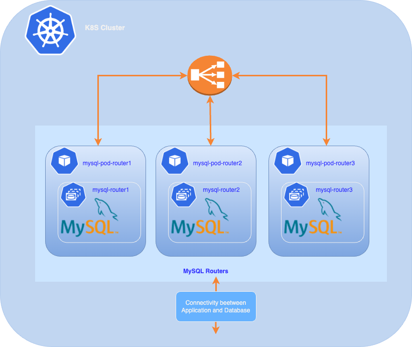

##   Implementing MySQL InnoDB Cluster Router in a Kubernetes Environment





Setting up a MySQL InnoDB Cluster within a Kubernetes environment involves strategic planning and proper placement of various components to ensure high availability and resilience. One of the critical components in this architecture is the MySQL Router. This article provides insights and recommendations on where and how to deploy the MySQL Router in a Kubernetes environment.

**Understanding MySQL InnoDB Cluster**

MySQL InnoDB Cluster is a distributed database solution that provides high availability and scalability through a native MySQL replication technology called Group Replication. The cluster is composed of MySQL server instances (nodes) and is managed via the MySQL Shell. In such setups, the MySQL Router acts as a middle layer that directs client traffic to the appropriate MySQL server instances.

**Role of MySQL Router**

MySQL Router is a middleware that provides transparent routing between your application and any MySQL server. It can be used for a wide range of use cases, such as high availability and scalability, by efficiently routing database traffic to the appropriate MySQL servers.

**Example: Deploying MySQL Router Only in Kubernetes**

In this example, we will see how to deploy our router using the deployment method with Kubernetes manifests. We will also explore how to achieve this using a Kubernetes operator or tools like ArgoCD or Terraform in future discussions.

❗️A question may arise: where should the MySQL Router service be deployed?

- **Same Namespace as the MySQL InnoDB Cluster:** Deploying MySQL Router in the same namespace as your MySQL InnoDB cluster can simplify communication between the router and the cluster due to network proximity. It can also make it easier to manage and monitor all database-related components in a single logical location.

- **Namespace of the Application:** If you have multiple applications using MySQL Router to access the database, you might consider deploying MySQL Router in the namespace of each application. This allows for isolation between applications and can offer more flexibility if applications require specific routing configurations.

Ultimately, the decision often depends on your overall architecture, security requirements, and how you want to structure operations and management within your Kubernetes cluster.

In our configuration, we have a single application, and we will deploy it in the same namespace as our MySQL InnoDB cluster.


## Prerequisites

Before deploying MySQL Router, ensure that you have the following prerequisites:
- A Kubernetes cluster set up and running with loadbalancer service
- Three MySQL instances installed and configured as a part of a MySQL InnoDB Cluster.
- MySQL Shell installed

## Steps

✅ **Step1 :** Created ConfigMap

We are going to create a ConfigMap that will contain the configuration of the Router service. We can later complete it if we want to add configuration parameters at the service startup.

05-router-config.yaml:
```yaml

apiVersion: v1
kind: ConfigMap
metadata:
  name: mysql-router-config
data:
  MYSQL_HOST: "dbc1-0.mysql.mysqldb.svc.cluster.local"
  MYSQL_PORT: "3306"
  MYSQL_USER: "clusteradmin"
  MYSQL_INNODB_CLUSTER_MEMBERS: "3"
 
```
Replace the values of the variables *MYSQL_HOST*, *MYSQL_PORT*, *MYSQL_USER*, and *MYSQL_INNODB_CLUSTER_MEMBERS* with your own.

Deploy this ConfigMap using the following command:
```bash

:> kubectl -n mysqldb apply -f 05-router-config.yaml
configmap/mysql-router-config created
:>
 
````

> **mysqldb** is the namespace where the MySQL InnoDB cluster is deployed

✅ **Step2 :** deploy a MySQL Router.
We have the following manifest file that will deploy our Router pod with 3 replicas and a LoadBalancer service, in case our applications are outside of our Kubernetes cluster.

05-deploy-router.yaml:
```yaml

apiVersion: apps/v1
kind: Deployment
metadata:
  name: mysql-router
spec:
  replicas: 3
  selector:
    matchLabels:
      app: mysql-router
  template:
    metadata:
      labels:
        app: mysql-router
    spec:
      containers:
      - name: mysql-router
        image: container-registry.oracle.com/mysql/enterprise-router:9.0.1-aarch64
        env:
        - name: MYSQL_HOST
          valueFrom:
            configMapKeyRef:
              name: mysql-router-config
              key: MYSQL_HOST
        - name: MYSQL_PORT
          valueFrom:
            configMapKeyRef:
              name: mysql-router-config
              key: MYSQL_PORT
        - name: MYSQL_USER
          valueFrom:
            configMapKeyRef:
              name: mysql-router-config
              key: MYSQL_USER
        - name: MYSQL_INNODB_CLUSTER_MEMBERS
          valueFrom:
            configMapKeyRef:
              name: mysql-router-config
              key: MYSQL_INNODB_CLUSTER_MEMBERS
        - name: MYSQL_PASSWORD
          valueFrom:
            secretKeyRef:
              name: mysql-admin-secret
              key: password
        ports:
        - containerPort: 6446
        - containerPort: 6447
        - containerPort: 6450

---
apiVersion: v1
kind: Service
metadata:
  name: mysql-router
spec:
  selector:
    app: mysql-router
  ports:
  - name: mysql-router-rw
    protocol: TCP
    port: 3306
    targetPort: 6446
  - name: mysql-router-ro
    protocol: TCP
    port: 6447
    targetPort: 6447
  - name: mysql-router-read-write-split
    protocol: TCP
    port: 6450
    targetPort: 6450
  type: LoadBalancer


```

> We will use the ConfigMap created in the previous step and the secret created for our cluster admin user: *clusteradmin*

Deploy the router:
```bash

:> kubectl -n mysqldb apply -f 05-deploy-router.yaml
deployment.apps/mysql-router created
service/mysql-router created


```

Check the the MySQL Router deployment :
```bash

:>  kubectl -n mysqldb get deployment mysql-router
NAME           READY   UP-TO-DATE   AVAILABLE   AGE
mysql-router   3/3     3            3           2m40s
:>

```
> Our deployment is successful,we have 3 replicas running.

To inspect the placement of the MySQL Router Pods :

```bash

:> kubectl get pods -o custom-columns="NAME:.metadata.name,NODE:.spec.nodeName" -n mysqldb|grep router
mysql-router-558949f84b-5c8vh   k8sdemos-worker2
mysql-router-558949f84b-7g6rd   k8sdemos-worker3
mysql-router-558949f84b-885g4   k8sdemos-worker
:>
 
```

We can see that our 3 instances are properly distributed across each node

Check  that our LoadBalancer service router is deployed correctly:
```bash

:> kubectl get services --field-selector spec.type=LoadBalancer -n mysqldb
NAME           TYPE           CLUSTER-IP     EXTERNAL-IP   PORT(S)                                        AGE
mysql-router   LoadBalancer   10.96.55.228   10.89.0.100   3306:32581/TCP,6447:30471/TCP,6450:32572/TCP   13m
:>
 
```

✅ **Step3 :** Check a connexion and router configuration in the cluster

We have an active LoadBalancer service, so we will connect to our MySQL InnoDB cluster using the external IP address of our service, which in our config is: *10.89.0.100*.

```bash

:> mysqlsh --uri clusteradmin@10.89.0.100 -p --js
Please provide the password for 'clusteradmin@10.89.0.100': 
Save password for 'clusteradmin@10.89.0.100'? [Y]es/[N]o/Ne[v]er (default No): Y
MySQL Shell 9.0.1

Copyright (c) 2016, 2024, Oracle and/or its affiliates.
Oracle is a registered trademark of Oracle Corporation and/or its affiliates.
Other names may be trademarks of their respective owners.

Type '\help' or '\?' for help; '\quit' to exit.
Creating a session to 'clusteradmin@10.89.0.100'
Fetching schema names for auto-completion... Press ^C to stop.
Your MySQL connection id is 0
Server version: 9.0.1-commercial MySQL Enterprise Server - Commercial
No default schema selected; type \use <schema> to set one.
 MySQL  10.89.0.100:3306 ssl  JS > 

```

The connection was successful 😀 , we connected from the outside through the Router to our cluster. We will now verify the router configuration.

```bash

MySQL  10.89.0.100:3306 ssl  JS > var cluster = dba.getCluster()
MySQL  10.89.0.100:3306 ssl  JS > cluster.listRouters()
{
    "clusterName": "dbcluster01", 
    "routers": {
        "mysql-router-558949f84b-5c8vh::": {
            "hostname": "mysql-router-558949f84b-5c8vh", 
            "lastCheckIn": "2024-10-23 11:03:24", 
            "roPort": "6447", 
            "roXPort": "6449", 
            "rwPort": "6446", 
            "rwSplitPort": "6450", 
            "rwXPort": "6448", 
            "version": "9.0.1"
        }, 
        "mysql-router-558949f84b-7g6rd::": {
            "hostname": "mysql-router-558949f84b-7g6rd", 
            "lastCheckIn": "2024-10-23 11:03:24", 
            "roPort": "6447", 
            "roXPort": "6449", 
            "rwPort": "6446", 
            "rwSplitPort": "6450", 
            "rwXPort": "6448", 
            "version": "9.0.1"
        }, 
        "mysql-router-558949f84b-885g4::": {
            "hostname": "mysql-router-558949f84b-885g4", 
            "lastCheckIn": "2024-10-23 11:03:24", 
            "roPort": "6447", 
            "roXPort": "6449", 
            "rwPort": "6446", 
            "rwSplitPort": "6450", 
            "rwXPort": "6448", 
            "version": "9.0.1"
        }
    }
}

```
We have our 3 Router instances running successfully.

## Next Step

The next step is the deployment of an application.

## Conclusion

Deploying MySQL Router in a Kubernetes environment enhances the resilience and scalability of your MySQL InnoDB Cluster deployment. By following best practices in containerization, scaling, security, and monitoring, you can ensure a robust infrastructure that meets the demands of modern applications. Future discussions will include deploying the MySQL Router using Kubernetes operators or infrastructure-as-code tools like ArgoCD and Terraform to streamline and automate the deployment process.

---
## Ressources

[Installing MySQL Router with Docker](https://dev.mysql.com/doc/mysql-router/9.0/en/mysql-router-installation-docker.html)


